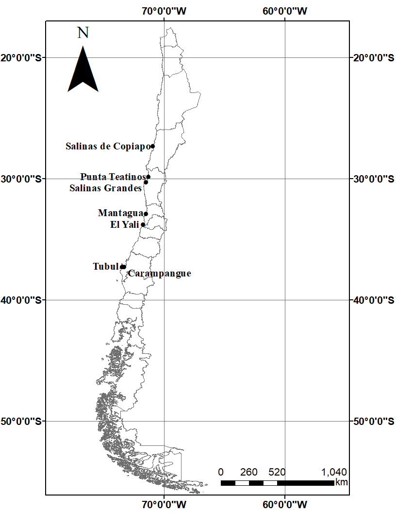

```{r setup, include=FALSE}
knitr::opts_chunk$set(echo = TRUE, warning = FALSE, error = FALSE, message = FALSE)
library(readxl)
library(lattice)
library(ggplot2)
library(tidyverse)
library(dplyr)
library(MuMIn)
library(broom)
library(caret)
library(FSA)
library(dunn.test)
library(DescTools)
library(rcompanion)
library(multcompView)
library(GmAMisc)
library(PMCMR)
library(gamm4)
library(mgcv)
library(jtools)
library(knitr)
library(kableExtra)
library(xtable)
library(skimr)
```

# INTRODUCCIÓN

Los humedales costeros se producen en la confluencia de ecosistemas de agua dulce, marinos y terrestres (Attrill & Rundle, 2002), donde las condiciones hidrológicas impulsadas por el clima, la topografía y la geología mantienen constantemente una alta saturación de agua del suelo, lo que permite el desarrollo de vegetación hidrófila (Jackson et al., 2014).
El clima en general suele ser un factor determinante en la composición de especies de plantas en los humedales costeros, ya que los factores estresantes abióticos como inundaciones, altas temperaturas y alta salinidad afectan la biodiversidad, la composición de especies y la distribución de comunidades de plantas costeras (Gedan & Bertness, 2009; Hook et al., 1991; McKee et al., 2004). En términos climáticos Chile presenta un gran gradiente climático latitudinal, cambiando desde hiperárido en latitudes bajas a hiperhúmedo en latitudes altas (Amigo & Ramirez, 1998). De esta manera, en el norte de Chile, la alta evaporación y la falta de lluvia dejan las marismas secas y salinas; en el centro de Chile, la precipitación es de casi 300 mm/año por lo que las marismas costeras tienen menor salinidad; mientras que en el sur de Chile, la precipitación es de casi 2.000 mm / año, por lo que las marismas suelen ser húmedas y con baja salinidad (Fariña & Camaño, 2012; Ramirez & Añazco, 1982). 
Si bien se sabe que este gradiente climático explica los cambios latitudinales en la zonación y dominancia de las especies vegetacionales en los humedales costeros (Fariña et al., 2018) no se ha evaluado en Chile si explica los cambios en terminos de la biomasa verde o patrones de productividad de estos ecosistemas. Una buen mecanismo para evaluar estos cambios es el uso de el Índice de Vegetación Mejorado (EVI , por sus siglas en inglés), el cual ha sido ampliamente aceptado como un indicador sensible que puede ser utilizado para monitorear las variaciones fenológicas (Wang y Tenhunen, 2004, Xie et al., 2008), biomasa verde (Rosental et al., 1985; Tucker et al., 1985; Prince, 1991), índice de área foliar (Asrar et al., 1984) y patrones de productividad (Goward & Dye, 1987), permitiendo así monitorear la condición de crecimiento de las plantas de humedales (Dong et al. ., 2014).

De esta manera, el objetivo de este trabajo consiste estudiar 7 humedales costeros de Chile a lo largo de un gradiente climatico latitudinal y evaluar si variables climáticas como la precipitación un la temperatura explican las variaciones en el indice de vegetación. 

# MATERIALES Y MÉTODOS    

## Área de Estudio

Se evaluaron 7 humedales costeros de Chile, distribuidos en un gradiente latitudinal (Figura 1). Todos estos humedales se encuentran en las desembocaduras de los ríos, debido a la estrecha plataforma oceánica presente. Además, se encuentran distribuidos a lo largo de regiones climáticas hiperáridas, áridas, semiáridas, húmedas e hiperhúmedas. Las especies dominantes en estos humedales costeros fueron: Salicornia fruticosa en la zona norte y central y Juncus acutus y Spartina densiflora en la zona centro y sur (tabla 1). 

{width=400px height=600px} 

##  Base de Datos

A partir de los productos MOD13Q1 y MYD13Q1 (versión 006) del espectro radiómetro de imágenes de resolución moderada (MODIS) TERRA y AQUA entre los años 2003 y 2016 descargados gratuitamente desde el siguiente sitio web  [link](https://daac.ornl.gov/), se generaron series de tiempo mensuales del Índice de vegetación Mejorado (EVI)  a partir de un solo pixel (de 250 metros de resolución espacial) con datos cada 8 días. 
Las variables climáticas fueron descargadas desde la base de datos CAMELS-CL (Catchment Attributes and Meteorology for Large Sample Studies, Chile Dataset) que integra información física e hidro-meteorológica de cuencas de todo Chile [link](http://www.cr2.cl/camels-cl/). De esta manera se obtuvieron series de tiempo mensuales de precipitación, temperatura (media, mínima y máxima) y evapotranspiración potencial (PET) integradas a las cuencas correspondientes a cada humedal. 

## Análisis de datos
Se realizó una prueba no paramétrica de Kruskal-Wallis para evaluar si existen diferencias significativas en la distribución de EVI entre los humedales.
Para evaluar que variables climáticas explican de mejor manera los cambios de EVI en cada humedal se generaron de manera exploratoria modelos GLM Gammas y Gausianos con todas las variables explicativas para determinar cuales eran las variables que mejor explicaba el EVI mediante criterios de información corregidos de Akaike (AICc), posteriormente a´partir de correlación se procedió a evaluar si existía colinealidad entre las variables explicativas y finalmente mediante validación cruzada, utilizando glm y dividiendo la base en 5 segmentos se generaron distintos modelos, excluyendo para cada humedal las variables que se contraban correlacionada


# RESULTADOS


```{r,echo = F, message = F, warning = F}
#Cargar archivo y añadir el nombre de las colunas
EVI <- read_excel("EVI.xlsx")
EVI$Sitio <- as.factor(EVI$Sitio)
EVI$Sitio <- factor(EVI$Sitio, levels = c("Salinas de Copiapo", "Punta Teatinos", "Salinas Grandes", "Mantagua", "El Yali", "Carampangue", "Tubul"))

#Para ver la media y la mediana de cada formacion
Resumen <- Summarize(EVI ~ Sitio,
          data = EVI)


```

Las series de tiempo de EVI (Figura \@ref(fig:Plot)) muestran que El Yali es el humedal costero que poseé los valores promedios más altos (`r round(Resumen$mean[2], digits = 2)` ± `r round(Resumen$sd[2], digits = 2)`) mientras que Carampangue tiene los valores mas bajos (`r round(Resumen$mean[1], digits = 2)` ± `r round(Resumen$sd[1], digits = 2)`).
La prueba no paramétrica de Kruskal-Wallis muestró diferencias significativasentre los sitios  (p < 0.05), mientras que la prueba posthoc dunn registró que solo los humedales de El Yali y Punta Teatinos presentan la misma distribución (p < 0.05), mientras que todos los demás humedales presentan una distribución diferente (\@ref(tab:KW))


```{r Plot, fig.width=8, fig.height=4, fig.cap="Boxplot que muestran la mediana (línea horizontal dentro de las cajas) y la variabilidad de EVI de los 7 humedales costeros estudiados (los humedales se encuentran ordenados desde menor a mayor latitud) ", echo=F}

boxplot(EVI ~ Sitio,
        data = EVI,
        par(cex.axis=0.6),
        ylab="EVI",
        xlab="")

```

```{r, echo = F, message = F, warning = F,  results = 'hide'}

#Existe  una diferencia significativa en las distribuciones en los valores entre formaciones, que se evidencia en histogramas
#y prueba de kruskall wallis
kruskal.test(EVI ~ Sitio,
             data = EVI)


# Ordenar las formaciones  por mediana
EVI$Sitio = factor(EVI$Sitio,
                       levels=c("El Yali", "Punta Teatinos", "Tubul",  "Salinas de Copiapo Sur", "Mantagua", "Salinas Grandes", "Carampangue",  "Salinas de Copiapo Norte"))

### Dunn test, dos formas, ambas con tablas de letras para saber cuales son iguales. 
#Forma 1
Post = posthoc.kruskal.dunn.test(EVI ~ Sitio, data=EVI)
PT1 = Post$p.value
PT2 = fullPTable(PT1)

PT1
Dunn <- multcompLetters(PT2,  
                compare="<",  
                threshold=0.05,
                Letters=letters,  
                reversed = FALSE)

```


```{r KW, echo=F}

tabla <- Dunn$monospacedLetters
knitr::kable(tabla, digits = 2, caption = "Prueba posthoc de Dunn para todos los sitios", align = "cc", col.names = "", full_width = F)
```

Las variables climáticas (Figura \@ref(fig:boxplots)) muestran que solo la precipitación registra un gradiente latitudinal, con valores que aumentan a medida que aumenta la latitud, mientras que el potencial de evapotranspiración y las temperaturas media, mínimas y máximas no registran un gradiente marcado, probablemente por que son valores integrados de la cuenca.  

```{r, echo = F, message = F, warning = F}
pp <- read_excel("pp.xlsx")
pp$Sitio <- factor(pp$Sitio, levels = c("Salinas de Copiapo", "Punta Teatinos", "Salinas Grandes", "Mantagua", "El Yali", "Arauco"))
T_min <- read_excel("T_min.xlsx")
T_min$Sitio <- factor(T_min$Sitio, levels = c("Salinas de Copiapo", "Punta Teatinos", "Salinas Grandes", "Mantagua", "El Yali", "Arauco"))
T_max <- read_excel("T_max.xlsx")
T_max$Sitio <- factor(T_max$Sitio, levels = c("Salinas de Copiapo", "Punta Teatinos", "Salinas Grandes", "Mantagua", "El Yali", "Arauco"))
T_mean <- read_excel("T_mean.xlsx")
T_mean$Sitio <- factor(T_mean$Sitio, levels = c("Salinas de Copiapo", "Punta Teatinos", "Salinas Grandes", "Mantagua", "El Yali", "Arauco"))
PET <- read_excel("PET.xlsx")
PET$Sitio <- factor(PET$Sitio, levels = c("Salinas de Copiapo", "Punta Teatinos", "Salinas Grandes", "Mantagua", "El Yali", "Arauco"))

```


```{r boxplots, fig.width=11, fig.height=6, fig.cap="Boxplot que muestran la mediana (línea horizontal dentro de las cajas) y la variabilidad de las variables climáticas de los sitios estudiados (los sitios se encuentran ordenados desde menor a mayor latitud) ", echo=F}

par(mfrow = c(2,3))

boxplot(T_mean ~ Sitio,
        data = T_mean,
        las=2,
        par(cex.axis=0.8),
        ylab="°C",
        xlab="", main="Temperatura media")

boxplot(T_min ~ Sitio,
        data = T_min,
        las=2,
        par(cex.axis=0.8),
        ylab="°C",
        xlab="", main="Temperatura mínima")

boxplot(T_max ~ Sitio,
        data = T_max,
        las=2,
        par(cex.axis=0.8),
        ylab="°C",
        xlab="", main="Temperatura máxima")


boxplot(pp ~ Sitio,
        data = pp,
        las=2,
        par(cex.axis=0.8),
        ylab="mm",
        xlab="", main="Precipitación")

boxplot(PET ~ Sitio,
        data = PET,
        las=2,
        par(cex.axis=0.8),
        ylab="mm",
        xlab="", main="Potencial de Evapo-transporación")

```


```{r, echo = F, message = F, warning = F}
Salinas_Copiapo <- read_excel("Salinas de Copiapo Sur.xlsx")
Punta_Teatinos <- read_excel("Punta Teatinos.xlsx")
Mantagua <- read_excel("Mantagua.xlsx")
Salinas_Grandes <- read_excel("Salinas Grandes.xlsx")
El_Yali <- read_excel("El Yali.xlsx")
Carampangue <- read_excel("Carampangue.xlsx")
Tubul <- read_excel("Tubul.xlsx")

#Se les suma una cte para eliminar valores negativos de NDVI, EVI y T_min
Salinas_Copiapo <- Salinas_Copiapo[,2:8] + 3.03 
Punta_Teatinos <- Punta_Teatinos[,2:8] + 3.03 
Salinas_Grandes <- Salinas_Grandes[,2:8] + 3.03 
El_Yali <- El_Yali[,2:8] + 3.03 
Carampangue <- Carampangue[,2:8] + 3.03 
Tubul <- Tubul[,2:8] + 3.03

##SABER SI LAS VARIABLES ESTAN CORRELACIONADAS
corr_Salinas_Copiapo <- abs(cor(Salinas_Copiapo[,3:7])) <= 0.7
corr_Salinas_Copiapo[!lower.tri(corr_Salinas_Copiapo)] <- NA #De la matriz anterior, solo se conserva un valor y no por duplicado

corr_Punta_Teatinos <- abs(cor(Punta_Teatinos[,3:7])) <= 0.7
corr_Punta_Teatinos[!lower.tri(corr_Punta_Teatinos)] <- NA

corr_Salinas_Grandes <- abs(cor(Salinas_Grandes[,3:7])) <= 0.7
corr_Salinas_Grandes[!lower.tri(corr_Salinas_Grandes)] <- NA

corr_El_Yali <- abs(cor(El_Yali[,3:7])) <= 0.7
corr_El_Yali[!lower.tri(corr_El_Yali)] <- NA

corr_Carampangue <- abs(cor(Carampangue[,3:7])) <= 0.7
corr_Carampangue[!lower.tri(corr_Carampangue)] <- NA

#MODELOS LINEALES GENERALIZADOS PARA ELEGIR LOS MEJORES MODELOS

Modelo_Salinas_Copiapo_gamma <- glm(EVI ~ pp + T_min + T_max + T_mean + PET, data = Salinas_Copiapo, family = Gamma)
Modelo_Salinas_Copiapo_gaussian <- glm(EVI ~ pp + T_min + T_max + T_mean + PET, data = Salinas_Copiapo, family = gaussian)

Modelo_Punta_Teatinos_gamma <- glm(EVI ~ pp + T_min + T_max + T_mean + PET, data = Punta_Teatinos, family = Gamma)
Modelo_Punta_Teatinos_gaussian <- glm(EVI ~ pp + T_min + T_max + T_mean + PET, data = Punta_Teatinos, family = gaussian)

Modelo_Salinas_Grandes_gamma <- glm(EVI ~ pp + T_min + T_max + T_mean + PET, data = Salinas_Grandes, family = Gamma)
Modelo_Salinas_Grandes_gaussian <- glm(EVI ~ pp + T_min + T_max + T_mean + PET, data = Salinas_Grandes, family = gaussian)

Modelo_El_Yali_gamma <- glm(EVI ~ pp + T_min + T_max + T_mean + PET, data = El_Yali, family = Gamma)
Modelo_El_Yali_gaussian <- glm(EVI ~ pp + T_min + T_max + T_mean + PET, data = El_Yali, family = gaussian)

Modelo_Carampangue_gamma <- glm(EVI ~ pp + T_min + T_max + T_mean + PET, data = Carampangue, family = Gamma)
Modelo_Carampangue_gaussian <- glm(EVI ~ pp + T_min + T_max + T_mean + PET, data = Carampangue, family = gaussian)

Modelo_Tubul_gamma <- glm(EVI ~ pp + T_min + T_max + T_mean + PET, data = Tubul, family = Gamma)
Modelo_Tubul_gaussian <- glm(EVI ~ pp + T_min + T_max + T_mean + PET, data = Tubul, family = gaussian)

options(na.action = "na.fail")

Selected_Modelo_Salinas_Copiapo_gamma <- dredge(Modelo_Salinas_Copiapo_gamma, subset = corr_Salinas_Copiapo)
Selected_Modelo_Salinas_Copiapo_gaussian  <- dredge(Modelo_Salinas_Copiapo_gaussian, subset = corr_Salinas_Copiapo)

Selected_Modelo_Punta_Teatinos_gamma <- dredge(Modelo_Punta_Teatinos_gamma, subset = corr_Punta_Teatinos)
Selected_Modelo_Punta_Teatinos_gaussian  <- dredge(Modelo_Punta_Teatinos_gaussian, subset = corr_Punta_Teatinos)

Selected_Modelo_Salinas_Grandes_gamma <- dredge(Modelo_Salinas_Grandes_gamma, subset = corr_Salinas_Grandes)
Selected_Modelo_Salinas_Grandes_gaussian  <- dredge(Modelo_Salinas_Grandes_gaussian, subset = corr_Salinas_Grandes)

Selected_Modelo_El_Yali_gamma <- dredge(Modelo_El_Yali_gamma, subset = corr_El_Yali)
Selected_Modelo_El_Yali_gaussian  <- dredge(Modelo_El_Yali_gaussian, subset = corr_El_Yali)

Selected_Modelo_Carampangue_gamma <- dredge(Modelo_Carampangue_gamma, subset = corr_Carampangue)
Selected_Modelo_Carampangue_gaussian  <- dredge(Modelo_Carampangue_gaussian, subset = corr_Carampangue)

Selected_Modelo_Tubul_gamma <- dredge(Modelo_Tubul_gamma, subset = corr_Carampangue)
Selected_Modelo_Tubul_gaussian  <- dredge(Modelo_Tubul_gaussian, subset = corr_Carampangue)


```

```{r, echo = F, message = F, warning = F}
#cREAR MODELOS SIN VARIABLES CORRELACIONADAS Y SEGUN LOS MEJORES MODELOS ANTERIORES
ctrl <- trainControl(method = "cv", number = 5)

#Para Carampangue y Tubul
form1 <- "EVI ~ PET"
form2 <- "EVI ~ pp + T_mean"
form3 <- "EVI ~ pp + T_min"
form4 <- "EVI ~ pp "
form5 <- "EVI ~ T_max"

forms <- list(form1, form2, form3, form4, form5)

#Para El resto de los sitios


form6 <- "EVI ~ PET"
form7 <- "EVI ~ PET + pp"
form8 <- "EVI ~ pp + T_min"
form9 <- "EVI ~ pp + T_max"
form10<- "EVI ~ T_min"
form11<- "EVI ~ T_max "
form12<- "EVI ~ T_mean"

forms2<- list(form6, form7, form8, form8, form10, form11, form12)

ctrl <- trainControl(method = "cv", number = 5)

K1= (2:6)#numero de parámetros (intercepto y 5 pendientes)
K2= (2:8)#numero de parámetros (intercepto y 7 pendientes)


Tests_Carampangue_Gamma <- forms %>% map(~train(as.formula(.x), 
                                         data = Carampangue, method = "glm", family = Gamma,
                                         trControl = ctrl)) %>% 
  map(~as.data.frame(.x$resample)) %>% 
  map(~select(.x, Rsquared)) %>% 
  map(~summarise_all(.x, funs(mean, 
                              sd), na.rm = T)) %>% map2(.y = forms, 
                                                        ~mutate(.x, model = .y)) %>% 
  reduce(bind_rows) %>% mutate(K1= K1)%>% 
  arrange(desc(mean))

Tests_Carampangue_Gaussian <- forms %>% map(~train(as.formula(.x), 
                                          data = Carampangue, method = "glm", family = gaussian,
                                          trControl = ctrl)) %>% 
  map(~as.data.frame(.x$resample)) %>% 
  map(~select(.x, Rsquared)) %>% 
  map(~summarise_all(.x, funs(mean, 
                              sd), na.rm = T)) %>% map2(.y = forms, 
                                                        ~mutate(.x, model = .y)) %>% 
  reduce(bind_rows) %>% mutate(K1= K1)%>% 
  arrange(desc(mean))


Tests_Tubul_Gamma <- forms %>% map(~train(as.formula(.x), 
                                          data = Tubul, method = "glm", family = Gamma,
                                          trControl = ctrl)) %>% 
  map(~as.data.frame(.x$resample)) %>% 
  map(~select(.x, Rsquared)) %>% 
  map(~summarise_all(.x, funs(mean, 
                              sd), na.rm = T)) %>% map2(.y = forms, 
                                                        ~mutate(.x, model = .y)) %>% 
  reduce(bind_rows) %>% mutate(K1= K1)%>% 
  arrange(desc(mean))

Tests_Tubul_Gaussian <- forms %>% map(~train(as.formula(.x), 
                                          data = Tubul, method = "glm", family = gaussian,
                                          trControl = ctrl)) %>% 
  map(~as.data.frame(.x$resample)) %>% 
  map(~select(.x, Rsquared)) %>% 
  map(~summarise_all(.x, funs(mean, 
                              sd), na.rm = T)) %>% map2(.y = forms, 
                                                        ~mutate(.x, model = .y)) %>% 
  reduce(bind_rows) %>% mutate(K1= K1)%>% 
  arrange(desc(mean))


Tests_Salinas_Copiapo_Gamma <- forms2 %>% map(~train(as.formula(.x), 
                                          data = Salinas_Copiapo, method = "glm", family = Gamma,
                                          trControl = ctrl)) %>% 
  map(~as.data.frame(.x$resample)) %>% 
  map(~select(.x, Rsquared)) %>% 
  map(~summarise_all(.x, funs(mean, 
                              sd), na.rm = T)) %>% map2(.y = forms2, 
                                                        ~mutate(.x, model = .y)) %>% 
  reduce(bind_rows) %>% mutate(K2= K2)%>% 
  arrange(desc(mean))

Tests_Salinas_Copiapo_Gaussian <- forms2 %>% map(~train(as.formula(.x), 
                                                   data = Salinas_Copiapo, method = "glm", family = gaussian,
                                                   trControl = ctrl)) %>% 
  map(~as.data.frame(.x$resample)) %>% 
  map(~select(.x, Rsquared)) %>% 
  map(~summarise_all(.x, funs(mean, 
                              sd), na.rm = T)) %>% map2(.y = forms2, 
                                                        ~mutate(.x, model = .y)) %>% 
  reduce(bind_rows) %>% mutate(K2= K2)%>% 
  arrange(desc(mean))


Tests_Punta_Teatinos_Gamma <- forms2 %>% map(~train(as.formula(.x), 
                                              data = Punta_Teatinos, method = "glm", family = Gamma,
                                              trControl = ctrl)) %>% 
  map(~as.data.frame(.x$resample)) %>% 
  map(~select(.x, Rsquared)) %>% 
  map(~summarise_all(.x, funs(mean, 
                              sd), na.rm = T)) %>% map2(.y = forms2, 
                                                        ~mutate(.x, model = .y)) %>% 
  reduce(bind_rows) %>% mutate(K2= K2)%>% 
  arrange(desc(mean))

Tests_Punta_Teatinos_Gaussian <- forms2 %>% map(~train(as.formula(.x), 
                                              data = Punta_Teatinos, method = "glm", family = gaussian,
                                              trControl = ctrl)) %>% 
  map(~as.data.frame(.x$resample)) %>% 
  map(~select(.x, Rsquared)) %>% 
  map(~summarise_all(.x, funs(mean, 
                              sd), na.rm = T)) %>% map2(.y = forms2, 
                                                        ~mutate(.x, model = .y)) %>% 
  reduce(bind_rows) %>% mutate(K2= K2)%>% 
  arrange(desc(mean))

Tests_Salinas_Grandes_Gamma <- forms2 %>% map(~train(as.formula(.x), 
                                             data = Salinas_Grandes, method = "glm", family = Gamma,
                                             trControl = ctrl)) %>% 
  map(~as.data.frame(.x$resample)) %>% 
  map(~select(.x, Rsquared)) %>% 
  map(~summarise_all(.x, funs(mean, 
                              sd), na.rm = T)) %>% map2(.y = forms2, 
                                                        ~mutate(.x, model = .y)) %>% 
  reduce(bind_rows) %>% mutate(K2= K2)%>% 
  arrange(desc(mean))

Tests_Salinas_Grandes_Gaussian <- forms2 %>% map(~train(as.formula(.x), 
                                               data = Salinas_Grandes, method = "glm", family = gaussian,
                                               trControl = ctrl)) %>% 
  map(~as.data.frame(.x$resample)) %>% 
  map(~select(.x, Rsquared)) %>% 
  map(~summarise_all(.x, funs(mean, 
                              sd), na.rm = T)) %>% map2(.y = forms2, 
                                                        ~mutate(.x, model = .y)) %>% 
  reduce(bind_rows) %>% mutate(K2= K2)%>% 
  arrange(desc(mean))

Tests_Mantagua_Gamma <- forms2 %>% map(~train(as.formula(.x), 
                                              data = Mantagua, method = "glm", family = Gamma,
                                              trControl = ctrl)) %>% 
  map(~as.data.frame(.x$resample)) %>% 
  map(~select(.x, Rsquared)) %>% 
  map(~summarise_all(.x, funs(mean, 
                              sd), na.rm = T)) %>% map2(.y = forms2, 
                                                        ~mutate(.x, model = .y)) %>% 
  reduce(bind_rows) %>% mutate(K2= K2)%>% 
  arrange(desc(mean))

Tests_Mantagua_Gaussian <- forms2 %>% map(~train(as.formula(.x), 
                                        data = Mantagua, method = "glm", family = gaussian,
                                        trControl = ctrl)) %>% 
  map(~as.data.frame(.x$resample)) %>% 
  map(~select(.x, Rsquared)) %>% 
  map(~summarise_all(.x, funs(mean, 
                              sd), na.rm = T)) %>% map2(.y = forms2, 
                                                        ~mutate(.x, model = .y)) %>% 
  reduce(bind_rows) %>% mutate(K2= K2)%>% 
  arrange(desc(mean))


Tests_El_Yali_Gamma <- forms2 %>% map(~train(as.formula(.x), 
                                       data =El_Yali, method = "glm", family = Gamma,
                                       trControl = ctrl)) %>% 
  map(~as.data.frame(.x$resample)) %>% 
  map(~select(.x, Rsquared)) %>% 
  map(~summarise_all(.x, funs(mean, 
                              sd), na.rm = T)) %>% map2(.y = forms2, 
                                                        ~mutate(.x, model = .y)) %>% 
  reduce(bind_rows) %>% mutate(K2= K2)%>% 
  arrange(desc(mean))

Tests_El_Yali_Gaussian <- forms2 %>% map(~train(as.formula(.x), 
                                       data =El_Yali, method = "glm", family = gaussian,
                                       trControl = ctrl)) %>% 
  map(~as.data.frame(.x$resample)) %>% 
  map(~select(.x, Rsquared)) %>% 
  map(~summarise_all(.x, funs(mean, 
                              sd), na.rm = T)) %>% map2(.y = forms2, 
                                                        ~mutate(.x, model = .y)) %>% 
  reduce(bind_rows) %>% mutate(K2= K2)%>% 
  arrange(desc(mean))


```

Se realizarón modelos lineales genelarizados para explicar la distribución de EVI a partir de las variables climáticas, para ello se utilizaron las familias gausiana y gamma (tablas \@ref(tab:SCopiapo), \@ref(tab:PTeatinos), \@ref(tab:SGrandes), \@ref(tab:Mantagua), \@ref(tab:Yali), \@ref(tab:Carampangue), \@ref(tab:Tubul)). Se observa que solo para el humedal de El Yali el EVI puede ser explicado con un R = `r round(Tests_El_Yali_Gaussian$mean[1], digits = 2)` tanto para el modelo gaussiano como el Gamma, las variables que mejor explicaron EVi en el humedal El Yali fueron para el modelo Gamma y Gaussiano el potencial de evapotranspiración, como también el potencial de evapotranspiración y la precipitación para el modelo Gamma. El EVI en el resto de los humedales costeros no es posible explicarlo con las variables evaluadas. 

```{r SCopiapo, echo= F}

Tests_Salinas_Copiapo_Gaussian %>%
  kable("html", align = 'clc', caption = 'R2 obtenido los modelos GLM Gausianos generados para explicar EVI en Salinas de Copiapo', digits = 2) %>%
    kable_styling(full_width = F, position = "float_left")
 
Tests_Salinas_Copiapo_Gamma %>%
  kable("html", align = 'clc', caption = ' R2 obtenido los modelos GLM Gammas generados para explicar EVI en Salinas de Copiapo', digits = 2) %>%
    kable_styling(full_width = F, position = "right")


```


```{r PTeatinos, echo= F}

Tests_Punta_Teatinos_Gaussian %>%
  knitr::kable("html", align = 'clc', caption = 'R2 obtenido los modelos GLM Gausianos generados para explicar EVI en Punta Teatinos', digits = 2) %>%
    kable_styling(full_width = F, position = "float_left")
 
Tests_Punta_Teatinos_Gamma %>%
  knitr::kable("html", align = 'clc', caption = 'R2 obtenido los modelos GLM Gammas generados para explicar EVI en Salinas de Copiapo', digits = 2) %>%
    kable_styling(full_width = F, position = "right")


```


```{r SGrandes, echo= F, results='asis'}

Tests_Salinas_Grandes_Gaussian %>%
  knitr::kable("html", align = 'clc', caption = 'R2 obtenido los modelos GLM Gausianos generados para explicar EVI en Salinas Grandes', digits = 2) %>%
    kable_styling(full_width = F, position = "float_left")
 
Tests_Salinas_Grandes_Gamma %>%
  knitr::kable("html", align = 'clc', caption = 'R2 obtenido los modelos GLM Gammas generados para explicar EVI en Salinas Grandes', digits = 2) %>%
    kable_styling(full_width = F, position = "right")


```


```{r Mantagua, echo= F, results='asis'}

Tests_Mantagua_Gaussian %>%
  knitr::kable("html", align = 'clc', caption = 'R2 obtenido los modelos GLM Gausianos generados para explicar EVI en Mantagua', digits = 2) %>%
    kable_styling(full_width = F, position = "float_left")
 
Tests_Mantagua_Gamma %>%
  knitr::kable("html", align = 'clc', caption = 'R2 obtenido los modelos GLM Gammas generados para explicar EVI en  Mantagua', digits = 2) %>%
    kable_styling(full_width = F, position = "right")


```


```{r Yali, echo= F, results='asis'}

Tests_El_Yali_Gaussian %>%
  knitr::kable("html", align = 'clc', caption = 'R2 obtenido los modelos  GLM Gausianos generados para explicar EVI en El Yali', digits = 2) %>%
    kable_styling(full_width = F, position = "float_left")
 
Tests_El_Yali_Gamma %>%
  knitr::kable("html", align = 'clc', caption = 'R2 obtenido los modelos GLM Gammas generados para explicar EVI en El Yali', digits = 2) %>%
    kable_styling(full_width = F, position = "right")


```


```{r Carampangue, echo= F, results='asis'}

Tests_Carampangue_Gaussian %>%
  knitr::kable("html", align = 'clc', caption = 'R2 obtenido los modelos  GLM Gausianos generados para explicar EVI en Carampangue', digits = 2) %>%
    kable_styling(full_width = F, position = "float_left")
 
Tests_Carampangue_Gamma %>%
  knitr::kable("html", align = 'clc', caption = 'R2 obtenido los modelos GLM Gammas generados para explicar EVI en Carampangue', digits = 2) %>%
    kable_styling(full_width = F, position = "right")


```


```{r Tubul, echo= F, results='asis'}

Tests_Tubul_Gaussian %>%
  knitr::kable("html", align = 'clc', caption = 'R2 obtenido los modelos GLM Gausianos generados para explicar EVI en Tubul', digits = 2) %>%
    kable_styling(full_width = F, position = "float_left")
 
Tests_Tubul_Gamma %>%
  knitr::kable("html", align = 'clc', caption = 'R2 obtenido los modelos GLM Gammas generados para explicar EVI en Tubul', digits = 2) %>%
    kable_styling(full_width = F, position = "right")


```

# DISCUSIÓN
Según los resultados obtenidos en este estudio es posible observar que existe un gradiente latitudinal de la precipitación, con valores bajos en latitudes bajas que aumentan a medida que aumenta la latitud, sin embargo, no es posible registrar este gradiente latitudinal en la temperatura y en el potencial de evapotranspiración, esto probablemente debido a que se utilizaron valores integrados de las cuenca. Por otro lado la biomasa verde o productividad de los humedales costeros de Chile, evaluada a partir del índice de vegetación mejorado, no se explica por las variables climáticas de precipitación, temperatura y potencial de evapotranspiración. Probablemente, para un analisis de esta naturalza no deban utilizarse datos climáticos integrados para la cuenca y deban ser utilizado registros obtenidos de las estaciones metereológicas mas cercanas a los sitios de estudio. 


# REFERENCIAS
Amigo, J., & Ramirez, C. (1998). An bioclimatic classification of Chile: Woodland communities in the temperate zone. Plant Ecology, 136, 9– 26.
Attrill, M. J., & Rundle, S. D. (2002). Ecotone or ecocline: ecological boundaries in estuaries. Estuarine, Coastal and Shelf Science, 55(6), 929-936.
Dong Z., Wang Z., Liu D., Song K., Li L., Jia M. y Ding Z. (2014)  Mapping wetland areas using landsat-derived ndvi and lswi: A case study of west Songnen plain, Northeast China. Journal of the Indian Society of Remote Sensing. 42, 569–576
Fariña, J. M., & Camaño, A. (2012). Humedales costeros de Chile: Aportes científicos a su gestión sustentable. Santiago: Ediciones UC.
Gedan, K. B., & Bertness, M. D. (2009). Experimental warming causes rapid loss of plant diversity in New England salt marshes. Ecology Letters, 12(8), 842– 848.
Hook, D. D., Buford, M. A., & Williams, T. M. (1991). Impact of hurricane Hugo on the South Carolina coastal plain forest. Journal of Coastal Research, 291– 300.
Jackson, C. R., Thompson, J. A., & Kolka, R. K. (2014). Wetland soils, hydrology and geomorphology. In: Batzer, D.; Sharitz, R., eds. Ecology of freshwater and estuarine wetlands. Berkeley, CA: University of California Press: 23-60. Chapter 2., 23-60.
McKee, K. L., Mendelssohn, I. A., & Materne, M. D. (2004). Acute salt marsh dieback in the Mississippi River deltaic plain: A drought‐induced phenomenon? Global Ecology and Biogeography, 13(1), 65– 73.
Ramirez, C., & Añazco, D. (1982). Variaciones estacionales en el desarrollo de Scyrpus californicus, Typha angustifolia y Phragmites communis en pantanos Valdivianos, Chile. Agrosur, 10, 111– 123.
Xie, Y.C., Sha, Z.Y. & Yu, M. (2008). Remote sensing imagery in vegetation mapping: areview. J. Plant Ecol. 1, 9–23.